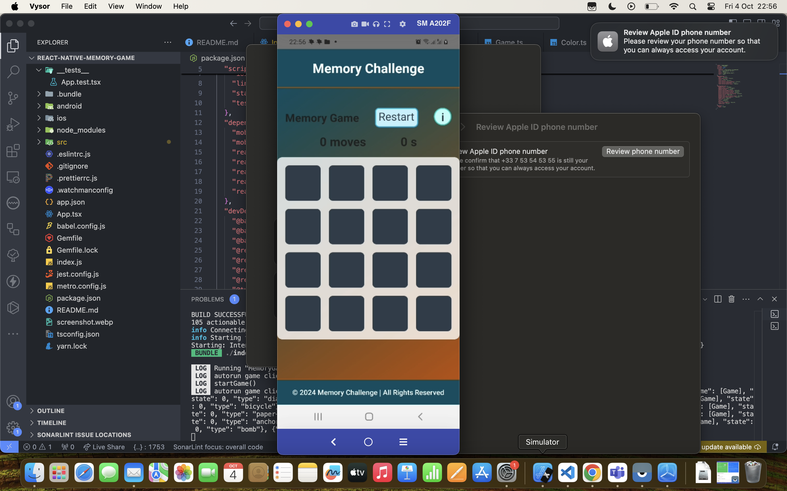
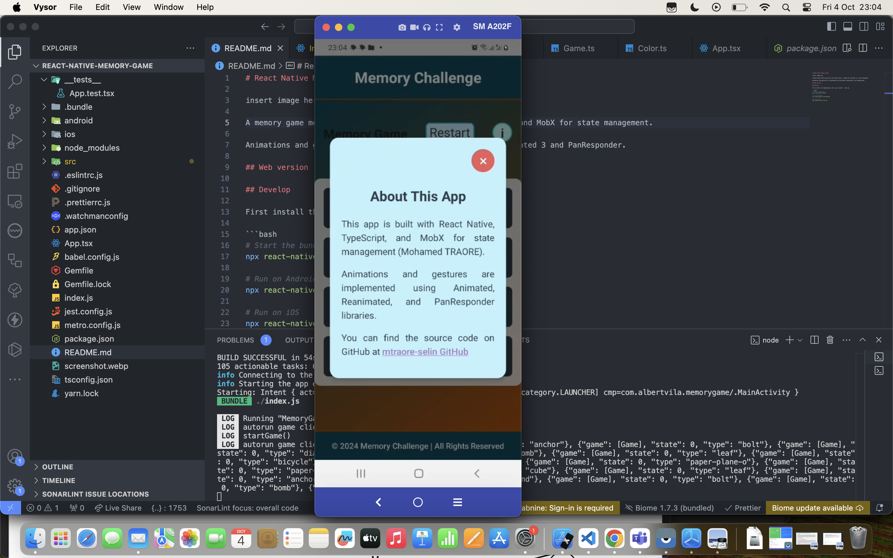

# React Native Memory Game

## Home Page



## About Page



A memory game mobile app built with React Native, TypeScript and MobX for state management.

Animations and gestures are implemented with Animated, Reanimated 3 and PanResponder.

## Web version

## Develop

First install the dependencies with `yarn install`, then do:

```bash
# Start the bundler
npx react-native start

# Run on Android
npx react-native run-android

# Run on iOS
npx react-native run-ios
```
